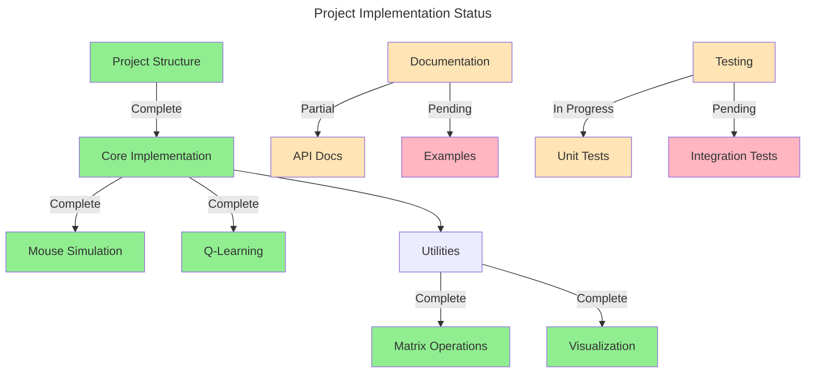

# Project Progress Tracking

> 💡 **Quick Status**: Q-Learning implementation complete, unit tests added for Q-Learning and visualization components.

## Project Overview

## Project Structure
- ✅ Create basic project structure
- ✅ Initialize package with `__init__.py`
- ✅ Set up `pyproject.toml` with dependencies
- ✅ Organize code into appropriate modules
- ✅ Set up documentation structure

## Code Modules

### Core Implementation
- ✅ Basic `MarkovChain` class structure
- ✅ Transition matrix validation
- ✅ Eigenvalue/eigenvector computation
- ✅ Stationary distribution calculation
- ✅ State distribution evolution

### Models

#### Mouse Simulation
- ✅ Basic simulation environment
- ✅ State transition logic
- ✅ Reward structure

#### Q-Learning Implementation
> 💡 **Status**: Core implementation complete

- ✅ Basic class structure
- ✅ Q-table initialization
- ✅ Action selection policies
  - ✅ ε-greedy implementation
  - ✅ Softmax implementation
- ✅ Core functionality
  - ✅ Q-value update function
  - ✅ Training loop implementation
  - ✅ Reward tracking and metrics
  - ✅ Policy extraction

### Utilities

#### Matrix Operations
- ✅ Stochastic matrix validation
- ✅ Matrix normalization
- ✅ Eigenvalue computation helpers

#### Visualization Utilities
- ✅ Distribution evolution plots
- ✅ Transition matrix heatmaps
- ✅ Q-Learning visualizations
  - ✅ Q-value heatmaps
  - ✅ Learning curve plots
  - ✅ Policy visualization

## Documentation
> ℹ️ **Note**: Documentation is being updated as features are implemented

- ✅ Add docstrings to core classes
- ⏳ API Documentation
  - [ ] Add docstring examples
  - [ ] Create usage examples in notebooks
  - [ ] Generate API reference
- ✅ Project Documentation
  - ✅ README.md with installation and usage
  - ✅ CONTRIBUTING.md guidelines
- ⏳ Code Quality
  - [ ] Add type hints to remaining functions

## Testing
> 💡 **Status**: Unit tests implemented for Q-Learning and visualization components

### Unit Tests
- ✅ Q-Learning components
  - ✅ Initialization and configuration
  - ✅ Action selection policies
  - ✅ Q-value updates
  - ✅ Training loop
  - ✅ Policy extraction
- ✅ Visualization utilities
  - ✅ Distribution evolution plots
  - ✅ Transition matrix plots
  - ✅ Q-table visualization
  - ✅ Learning curves
  - ✅ Policy visualization
- ⏳ MarkovChain class
- ⏳ Matrix operations
- ⏳ Mouse simulation

### Integration Tests
- [ ] End-to-end workflows
- [ ] Cross-component integration
- [ ] Performance benchmarks

### CI/CD
- ✅ Test configuration
  - ✅ pytest setup
  - ✅ Coverage reporting
  - ✅ Test markers
- [ ] Automated pipeline
- [ ] Performance regression tests

## Implementation Roadmap

### 1. Complete Testing Infrastructure
- [ ] Remaining unit tests
  - MarkovChain class
  - Matrix operations
  - Mouse simulation
- [ ] Integration tests
  - End-to-end training workflow
  - Component interaction tests
  - Performance benchmarks

### 2. Documentation
- [ ] API documentation
- [ ] Usage examples
- [ ] Performance guidelines

### 3. Optimization
- [ ] Performance profiling
- [ ] Matrix operation optimization
- [ ] Memory usage optimization

### 4. Matrix Operations Visualization Proof of Concept
> 💡 **Status**: Planning phase

#### Interactive Visualization Requirements
- [ ] Matrix transformation visualization
  - [ ] Input matrix display
  - [ ] Transformation animation
  - [ ] Result matrix display
  - [ ] Step-by-step visualization of operations

#### Core Features
- [ ] Stochastic Matrix Visualization
  - [ ] Row probability distribution display
  - [ ] Row sum validation visualization
  - [ ] Color-coded probability values
  - [ ] Interactive cell editing

- [ ] Matrix Operation Demonstrations
  - [ ] Symmetrization visualization
    - [ ] Original matrix
    - [ ] Transpose operation
    - [ ] Averaging animation
    - [ ] Final symmetric result
  - [ ] Probability matrix clipping
    - [ ] Value range visualization
    - [ ] Clipping animation
    - [ ] Normalization effect
  - [ ] Row normalization
    - [ ] Sum computation display
    - [ ] Division operation animation
    - [ ] Final normalized result

#### Technical Implementation
- [ ] Web-based interactive interface
  - [ ] Matrix input component
  - [ ] Operation selection
  - [ ] Real-time validation
  - [ ] Result display
- [ ] Visualization library integration
  - [ ] D3.js for matrix visualization
  - [ ] Animation framework
  - [ ] Color schemes for probability values
- [ ] Backend API
  - [ ] Matrix operation endpoints
  - [ ] Validation services
  - [ ] Result computation

#### Documentation
- [ ] Usage examples
- [ ] API documentation
- [ ] Interactive tutorial
- [ ] Example notebooks

## Recent Progress

> 💡 **Latest Updates**

- Implemented comprehensive Q-Learning unit tests
- Added visualization component tests
- Set up pytest configuration with coverage reporting
- Created test fixtures and utilities

## Technical Challenges

### Challenge: Test Environment Setup
> ℹ️ **Solution**: Created SimpleGridEnv for controlled Q-Learning testing

### Challenge: Visualization Testing
> ℹ️ **Solution**: Implemented non-visual assertions for matplotlib outputs

## Notes and Considerations

> ℹ️ **Current Status**
- Core Q-Learning implementation complete
- Unit tests added for key components
- Test infrastructure in place
- Ready for remaining unit tests

> 💡 **Next Steps**
- Implement remaining unit tests
- Add integration tests
- Complete documentation
- Profile and optimize performance 